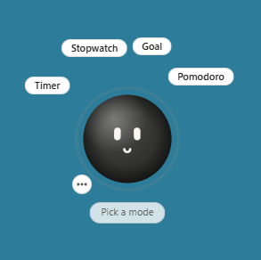
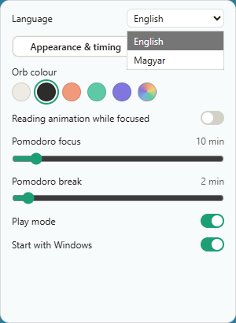
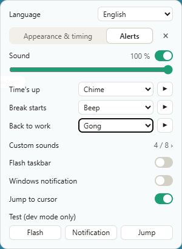

# FORBY

A tiny always-on-top desktop timer for Windows: a draggable orb with a face, a progress ring and four timing modes.



> The user interface is bilingual (English / Magyar). The language can be switched at the top of the Settings panel; a fresh install starts in English.

## Features

- **Always-on-top widget.** Frameless, transparent, non-resizable window. Transparent areas let clicks through to whatever is underneath.
- **Four modes.** Countdown timer, stopwatch, goal stopwatch (counts up towards a target, then keeps counting overtime and signals every full lap) and Pomodoro (focus/break cycles that switch automatically; lengths are configurable, default 25/5).
- **Quick duration picking.** Preset chips (5, 15, 25, 45, 60 minutes), mouse wheel over the orb for ±1 minute, or a typed value (`45`, `90`, `1:30`).
- **Pause, resume, stop and a summary** at the end of each session (total time, target vs. overtime, completed pomodoros).
- **Progress ring** around the orb that reflects the current mode: filling arc, coral overtime arc, a rotating sweep for the stopwatch, colour cycling during breaks, pulsing when the alarm fires.
- **A face that reacts.** The orb watches the cursor, blinks, dozes off when idle, and shows different expressions for focus, break, pause, overtime and alarm.
- **Play mode.** Throw the orb and it slides with momentum, bounces off screen edges and squashes on impact. Works across multiple monitors, including ones with different DPI scaling. Can be switched off for plain dragging.
- **Alarms.** Four built-in sounds synthesised with Web Audio (chime, bell, beep, gong), a separate sound for each event (time is up, break starts, back to work), shared volume control and preview.
- **Custom sounds.** Record up to 5 seconds from the microphone or upload an audio file (max 5 MB, 10 seconds). Up to 8 sounds in a library; each can be renamed, deleted and assigned to any event.
- **More ways to get your attention.** Taskbar flashing, a Windows toast notification, and an option to make FORBY jump next to the cursor when the timer runs out. Each can be toggled separately.
- **Appearance.** Five orb colour presets plus a custom colour picker, and an optional reading animation during focus.
- **Tray icon.** Left click brings FORBY to the front. Right click: open settings, move FORBY to the centre of the primary monitor, quit.
- **Start with Windows.** Registers itself in the current user's Run key; can be turned off in settings.
- **Settings persist** across restarts, as does the window position.
- **Log file** at `%LOCALAPPDATA%\studio.wow.forby\logs\forby.log`, rotated at 1 MB.


*Appearance & timing*


*Alerts*

## Install

FORBY runs on Windows.

1. Download the latest `FORBY_<version>_x64-setup.exe` from [GitHub Releases](../../releases).
2. Run the installer. It is an NSIS installer that installs per user (into `%LOCALAPPDATA%\FORBY` by default), so no administrator rights are needed.

Uninstalling removes the autostart entry as well.

## Build from source

Prerequisites:

- [Node.js](https://nodejs.org/) (LTS)
- [Rust](https://www.rust-lang.org/tools/install) (stable toolchain)
- [Tauri CLI v2](https://v2.tauri.app/start/prerequisites/) and the Windows prerequisites it lists (Visual Studio C++ build tools, WebView2)

```sh
npm install
npm run fetch-whisper # whisper.cpp binaries (pinned, sha256-checked) into src-tauri/binaries; needed before any build
npm run tauri dev     # development build with hot reload
npm run tauri build   # release build; the NSIS installer lands in src-tauri/target/release/bundle/nsis/
```

Note: the autostart entry is only written by release builds. Development builds never register themselves.

## Privacy

**FORBY works completely offline.** It makes no network requests, sends no data anywhere and contains no telemetry, analytics or crash reporting. Everything it stores (settings, window position, custom sounds, the log file) stays in your local app data folder.

## Roadmap

- **v0.3: voice control.** Push-to-talk with offline speech recognition.

## Known issues

- **Autostart path is written without quotes.** The entry in `HKCU\Software\Microsoft\Windows\CurrentVersion\Run` contains the unquoted path to `FORBY.exe`. This is how `tauri-plugin-autostart` (via `auto-launch`) writes it. It works in practice, but it is fragile if the install path contains spaces (for example a user name with a space in it).

## License

[MIT](LICENSE) © 2026 Víg Réka
